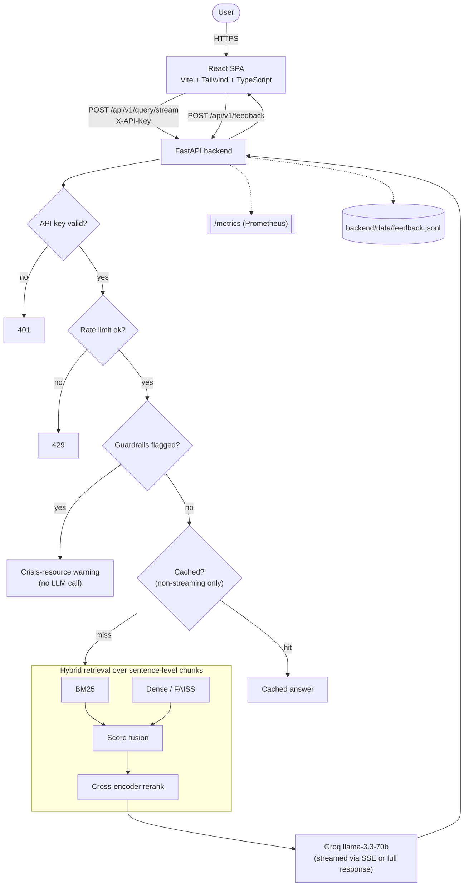

# HealthLens

HealthLens is a full-stack medical Q&A app that answers questions grounded in PubMed
literature. It runs hybrid retrieval (BM25 + dense embeddings over sentence-level
chunks, fused and reranked by a cross-encoder) against a local 200k-abstract corpus,
optionally decomposes complex questions into sub-queries, and generates cited answers
via Groq (Llama 3.3 70B) — streamed token-by-token or returned as a single response.

> **Not medical advice.** Educational and research use only. Always consult a
> qualified healthcare professional. See [Disclaimer](#disclaimer).

## Features

- **Hybrid retrieval** — BM25 + dense (FAISS) fusion over sentence-level chunks of
  each abstract, deduplicated back to one result per PMID, then reranked by a
  cross-encoder (`cross-encoder/ms-marco-MiniLM-L-6-v2`)
- **Query decomposition** — complex multi-part questions are split into sub-queries
  via Groq before retrieval, then merged
- **Streaming answers** — `/api/v1/query/stream` sends the Groq response
  token-by-token over SSE; `/api/v1/query` returns the full answer in one response
- **Query caching** — 500-entry, 1-hour TTL in-memory cache keyed on the normalized
  question + decompose flag
- **Feedback loop** — every answer carries a `query_id`; thumbs up/down posts to
  `/api/v1/feedback` and appends to `backend/data/feedback.jsonl`
- **Guardrails** — regex-based self-harm/crisis detection short-circuits before the
  LLM is ever called, returning crisis resources instead
- **API key auth + rate limiting** — `X-API-Key` required on cost-bearing endpoints;
  per-IP rate limit via `slowapi`
- **Observability** — structured JSON logs with per-request correlation IDs,
  `/health/live` + `/health/ready` probes, `/metrics` (Prometheus)

## Architecture



## Eval results

Evaluated on **50 medical questions** against the full **200,000-abstract** corpus
(Recall@5, MRR, Precision@5, top-5 retrieval):

| Mode | Recall@5 | MRR | Precision@5 |
|---|---|---|---|
| BM25-only | 0.060 | 0.121 | 0.060 |
| Dense-only | 0.000 | 0.000 | 0.000 |
| Hybrid (BM25 + dense fusion) | 0.092 | 0.190 | 0.092 |
| **Hybrid + cross-encoder rerank** | **0.120** | **0.266** | **0.120** |

Hybrid + rerank is the shipped default and outperforms hybrid-alone by **30%** on
Recall@5, and BM25-alone by **100%**. See [Design decisions](#design-decisions-the-hubness-investigation)
for why dense-only sits at exactly 0.000 and why reranking (not a "better" embedding
model) was the fix.

Reproduce:

```bash
cd backend && python eval/eval_harness.py
```

## Design decisions: the hubness investigation

Dense-only retrieval scores exactly **0.000** — not "poor," but a complete failure:
across all 50 benchmark questions, it returns the **same handful of PMIDs regardless
of query topic** (confirmed by inspection — identical top-5 for unrelated cardiology,
anticoagulation, and stroke questions). This is **embedding hubness**: in a bi-encoder
space, a small set of generically-worded documents sit near the centroid and win
cosine similarity against almost any query, independent of what the query is actually
about. It's a known failure mode of small general-purpose sentence embedding models
at large corpus scale, and it gets *worse*, not better, as the corpus grows — an 8k-doc
subset didn't reproduce it as severely as the full 200k corpus did.

Five fixes were tried, in order, before landing on the one that worked:

| # | Approach | Result |
|---|---|---|
| 1 | L2-normalization audit | Not the bug — both query and doc embeddings verified as exact unit vectors |
| 2 | `IndexFlatIP` → `IndexFlatL2` | Mathematically proven and empirically confirmed identical rankings for normalized vectors — not a real candidate |
| 3 | Query expansion (LLM synonyms, averaged embedding) | Broke the "identical top-5" pattern but only reached 0.024 recall — not enough |
| 4 | Hub-frequency suppression (penalize frequent docs) | **0.000** — the candidate *pool itself* was degenerate (same ~10 docs for every probe query); no amount of reordering fixes a pool that never contained the right answer |
| 5 | Mean-centering (subtract corpus centroid, renormalize) | No change — hub domination isn't a simple directional bias a linear shift can fix |

Two model swaps were also tried and reverted:

- **NeuML/pubmedbert-base-embeddings** (domain-specific model): same dense hubness
  failure pattern, and dragged hybrid fusion *below* BM25-alone on a coverage subset
- **Sentence-level chunking** (index chunks instead of whole abstracts): statistically
  identical Recall@5 to whole-abstract indexing on a same-subset comparison — kept
  anyway (see `retrieval.py`) since it's architecturally sound and directly relevant
  once a better embedding model is found, but it isn't what closed the recall gap

**What actually worked:** a cross-encoder reranking stage on top of hybrid fusion.
BM25's candidate pool isn't hub-corrupted, so it reliably contains the right document
even when dense doesn't help find it; the reranker then scores (query, doc) pairs
jointly instead of via a shared embedding space, so it's structurally immune to
hubness. Dense retrieval is kept as a weak auxiliary signal inside fusion — never
trusted standalone.

**Still open:** the underlying dense embedding model itself hasn't been fixed, only
worked around. A properly fine-tuned domain-specific embedding model (contrastive
training on this corpus) is the likely real fix, but is out of scope for a config
swap or index change.

## Project structure

```
healthlens/
├── backend/
│   ├── main.py                 # FastAPI app: routes, auth, rate limiting, SSE
│   ├── config.py                # pydantic-settings, single source of env config
│   ├── retrieval.py             # chunking, BM25 + dense + FAISS, cross-encoder rerank
│   ├── query_decomposition.py   # LLM-driven sub-query splitting + merge
│   ├── llm.py                    # Groq calls (streaming + non-streaming)
│   ├── cache.py                  # TTL/LRU query cache
│   ├── feedback.py               # thumbs up/down JSONL log
│   ├── metrics.py                # Prometheus metric definitions
│   ├── guardrails.py             # self-harm/crisis regex detection
│   ├── logging_config.py         # structured JSON logging + request IDs
│   ├── ingest.py                 # live PubMed fetch fallback (no local corpus)
│   ├── index_pubmed.py           # one-time bulk corpus indexer
│   ├── eval/
│   │   ├── eval_harness.py
│   │   ├── benchmark.json        # 50 questions with ground-truth PMIDs
│   │   └── results.json
│   ├── tests/                    # pytest suite
│   ├── data/
│   │   ├── pubmed_abstracts.jsonl  # gitignored, ~200k abstracts
│   │   ├── index_cache/            # gitignored, cached embeddings/FAISS index
│   │   └── feedback.jsonl          # gitignored, runtime-generated
│   ├── Dockerfile
│   ├── requirements.txt
│   └── requirements-dev.txt
├── frontend/
│   ├── src/
│   │   ├── App.tsx                # main UI, SSE consumer, feedback buttons
│   │   ├── ErrorBoundary.tsx
│   │   └── main.tsx
│   ├── Dockerfile
│   └── nginx.conf
├── docker-compose.yml
├── .github/workflows/ci.yml
└── README.md
```

## Setup

### Prerequisites

- Python 3.12+
- Node.js 22+
- A [Groq API key](https://console.groq.com/)
- Optional: [NCBI API key](https://www.ncbi.nlm.nih.gov/account/) for bulk indexing

### Local development

```bash
cd backend
python -m venv venv
source venv/bin/activate   # Windows: venv\Scripts\activate
pip install -r requirements-dev.txt   # includes pytest, ruff

cp .env.example .env
# edit .env: set GROQ_API_KEY and HEALTHLENS_API_KEY
# generate a key: python -c "import secrets; print(secrets.token_urlsafe(32))"

uvicorn main:app --reload --port 8000
```

The first request that needs retrieval builds the corpus index (BM25 + dense
embeddings over sentence chunks) and caches it to `data/index_cache/` — this is the
slow step (minutes, scales with corpus size and machine). Subsequent starts load
from cache. If `data/pubmed_abstracts.jsonl` is missing, `/query` falls back to a
live per-request PubMed fetch instead.

```bash
cd frontend
npm install
cp .env.example .env   # set VITE_HEALTHLENS_API_KEY to match the backend
npm run dev
```

Open [http://localhost:5173](http://localhost:5173).

Run tests and lint:

```bash
cd backend && pytest -v && ruff check .
cd frontend && npm run lint && npm run build   # build runs tsc --noEmit first
```

### Docker

```bash
# in repo root, with GROQ_API_KEY / HEALTHLENS_API_KEY set in your shell or a .env file
docker compose up --build
```

This builds both services (multi-stage Dockerfiles, non-root users, baked-in model
weights for offline startup) and mounts `backend/data` read-only into the backend
container. Frontend serves on `:5173` (nginx), backend on `:8000`.

## Environment variables

**Backend** (`backend/.env`, see `backend/.env.example`):

| Variable | Default | Purpose |
|---|---|---|
| `GROQ_API_KEY` | — | Required. Groq API key for answer generation |
| `HEALTHLENS_API_KEY` | — | Required. Clients must send this as `X-API-Key` |
| `NCBI_API_KEY` | — | Optional. Raises NCBI E-utilities rate limits for `index_pubmed.py` |
| `ENVIRONMENT` | `development` | `production` enables stricter behavior via `settings.is_production` |
| `CORS_ORIGINS` | `http://localhost:5173` | Comma-separated allowed frontend origins |
| `RATE_LIMIT_PER_MINUTE` | `20` | Per-IP limit on `/query` and `/query/stream` |
| `LOG_LEVEL` | `INFO` | Structured logger level |
| `EMBEDDING_MODEL_ID` | `sentence-transformers/all-MiniLM-L6-v2` | Dense embedding model — swap requires deleting `data/index_cache/` |
| `RERANKER_MODEL_ID` | `cross-encoder/ms-marco-MiniLM-L-6-v2` | Cross-encoder reranker model |

**Frontend** (`frontend/.env`, see `frontend/.env.example`):

| Variable | Default | Purpose |
|---|---|---|
| `VITE_API_URL` | `http://localhost:8000` | Backend base URL |
| `VITE_HEALTHLENS_API_KEY` | — | Baked into the built JS bundle — see the caveat in `.env.example` and `App.tsx` about this not being a real secret in a public SPA |

## API reference

All `/api/v1/*` endpoints require header `X-API-Key: <HEALTHLENS_API_KEY>` and are
rate-limited per IP. `/health/*` and `/metrics` are unauthenticated.

### `POST /api/v1/query`

```json
{ "question": "What are the latest treatments for type 2 diabetes?", "decompose": false }
```

```json
{
  "query_id": "b7e2...",
  "answer": "...",
  "sources": [{ "title": "...", "pmid": "12345678" }],
  "flagged": false,
  "warning": null
}
```

### `POST /api/v1/query/stream`

Same request body. Response is `text/event-stream`, hand-rolled SSE (not native
`EventSource` — see `App.tsx` for why: POST bodies and custom headers aren't
supported by the browser `EventSource` API). Events, in order:

```
event: sources
data: {"sources": [...], "query_id": "b7e2..."}

event: token
data: {"text": "The"}

event: token
data: {"text": " latest"}

...

event: done
data: {}
```

A flagged (guardrail-blocked) question sends `event: flagged` with `{"warning": "..."}`
instead of `sources`/`token`/`done`. Failures send `event: error` with `{"detail": "..."}`.

### `POST /api/v1/feedback`

```json
{ "query_id": "b7e2...", "rating": "up", "answer_preview": "The latest treatments..." }
```

Appends to `backend/data/feedback.jsonl`. `rating` must be `"up"` or `"down"`.

### `GET /health/live` / `GET /health/ready`

Liveness (process is up) vs. readiness (corpus index warm + LLM key configured — a
missing local corpus is *not* a readiness failure, since `/query` transparently falls
back to live PubMed fetch). Readiness returns `503` when not ready.

### `GET /metrics`

Prometheus exposition format: `request_latency_seconds`, `requests_total`,
`cache_hits_total`, `groq_tokens_used_total`, `retrieval_recall_proxy`.

## CI/CD

`.github/workflows/ci.yml` runs on every push/PR: backend lint (`ruff`) + test
(`pytest`) + Docker build, frontend lint (`eslint`) + typecheck+build (`tsc` + `vite
build`) + Docker build.

## Disclaimer

HealthLens is for educational and research purposes only. It does not provide
medical advice, diagnosis, or treatment. Always consult a qualified healthcare
professional. Unsafe queries (e.g. self-harm) are blocked before reaching the LLM and
show crisis resources (911, 988) instead.
